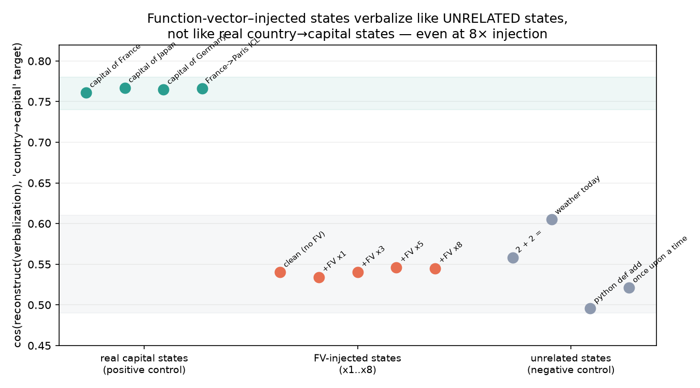

## The one-sentence version

I tried to read what a *function vector* "means" by feeding it through a *natural-language autoencoder* — a tool that turns a model's internal activations into English. It doesn't work. And the way it fails is the interesting part: the **exact same function vector that provably steers the model's behavior leaves no trace in the language readout of the state it produces**. Steering and verbalizability come apart.

This came out of a ~1-day pilot for a bigger idea that the pilot then killed. Writing it up because the negative is clean and the dissociation is easy to assume away.

## The two tools, briefly

**Function vectors (FVs)** [Todd et al., 2023]. Give a model a few in-context examples of a task — `France→Paris, Japan→Tokyo, ...` — and it forms a compact internal representation of "the task." You can pull this out as a single vector (a sum of the outputs of the attention heads that carry the task) and *inject* it into a fresh, example-free pass to make the model do the task with no demonstrations. FVs are a **write** interface: a handle you add to the residual stream to make the model *do* something.

**Natural-language autoencoders (NLAs)** [Anthropic / Transformer Circuits, 2026]. A pair of fine-tuned models. The *verbalizer* takes an activation and writes an English description of what it represents; the *reconstructor* goes back from English to a vector. NLAs are a **read** interface.

The idea I was chasing: FVs write, NLAs read — so point the reader at the writer and get **legible, nameable task primitives**. Extract an FV, verbalize it, and it should describe its task. The first thing to check is the most basic link: does an FV verbalize as its task at all?

## Setup (the short version)

`Qwen2.5-7B-Instruct` on a laptop, forward-pass only, no training. The NLA is Anthropic's released Qwen checkpoint pair that reads/writes the layer-20 residual stream. The function vector is for the **country→capital** task, extracted with Todd et al.'s method. To avoid eyeballing paragraphs, I score a verbalization by reconstructing it back to a vector and measuring cosine similarity to a "country→capital" target vector — higher means the verbalization's meaning is nearer "country→capital." (The reconstructor is itself lossy, so this metric isn't ground truth — which is why the controls below matter.)

## Step 1: the FV steers (the write side works)

Add the country→capital FV at layer 17 of a zero-shot `Q: <country>\nA:` prompt and look at the next token:

- `Q: France\nA:` → **"Paris"** enters the top-3 (9.1%) *only with the FV*, absent from the clean run.
- `Q: Japan\nA:` → **"Tokyo"** enters the top-3 (5.5%) *only with the FV*.

Modest — this is 7B zero-shot, not the ideal in-context setup — but unambiguous. The write side works.

## Step 2: the FV does not verbalize (the read side fails)

Two ways to read it, both fail:

**(a) Verbalize the raw FV.** Feed it straight to the verbalizer → incoherent stuff about "structured math / TensorFlow / the number 15." No geography. Unsurprising in hindsight: a raw FV is a *sum of head outputs*, not a state the model actually occupies, so it's off-distribution for a verbalizer trained on real activations.

**(b) Verbalize the FV's *effect*.** The principled version: add the FV during a forward pass and verbalize the *actual* layer-20 state it produces (a real, on-distribution activation, just nudged). At first this looked like it worked — the FV-steered `Q: France\nA:` verbalized as *"...what is the capital of...trivia about a country..."*.

But that was **prompt leakage** — the prompt already said "France." Redo it on **neutral prompts** with no geography (`"The answer is"`, `"I think that"`, `"It is"`) and the country/capital signal vanishes. With and without the FV, the verbalizations are basically identical, and neither mentions countries or capitals.

## Step 3: making the negative airtight

A null only means something if the instrument can detect a true positive and you pushed the intervention hard enough. Two controls:

- **Positive control:** score *real* country→capital states (the layer-20 activation at the answer position of "The capital of France is") vs. clearly-unrelated states (`2+2=`, python code, "once upon a time").
- **Strong injection:** re-run (b) at injection strengths ×1, ×3, ×5, ×8. At ×8 the state is heavily perturbed (cosine to clean drops to 0.62), so this is not a timid nudge.

Everything on one axis:

- **Real capital states: ~0.76.** The metric lights up; the verbalizer even describes them as *"a famous city in Japan... what is the capital of..."*. The instrument is not blind.
- **Unrelated states: ~0.55.**
- **FV-injected states: ~0.54, flat from ×1 to ×8.** They sit in the *unrelated* band and never move toward the capital band, even when the injection nearly breaks the state.

So the null in Step 2 is real — not a dead metric, not a too-gentle nudge.

## The finding: steering ≠ verbalizability

> The **same function vector** that provably changes the model's behavior (makes it say "Paris"/"Tokyo") produces **no detectable change** in the natural-language readout of the resulting state — while a genuine country/capital context reads out loud and clear.

In other words: **function vectors act on the model's *predictive* machinery without altering the *gist* that a natural-language autoencoder reads.** Behavioral effect and verbalizable content are separable properties of an activation.

A little counterintuitive if you started (like I did) from "FVs write, NLAs read, so NLAs should read what FVs write." They operate at different granularities. The verbalizer describes the *dominant content* of a state; an FV is a *directional nudge* that reshapes the next-token distribution without necessarily changing what the state is mostly "about." The reader and the writer aren't looking at the same thing.

## Why I'm stopping here (and what it opens)

The idea this pilot was testing — a legible read/write loop over task primitives — needs the reader to see what the writer wrote. It can't, at least not with these two tools used this way. So that idea's out.

But the dissociation suggests a better-posed question, if I (or anyone) wanted to chase it: **when *can* and *can't* natural-language readouts detect activation-space interventions?** FVs are one point — behavioral steering, invisible to the readout. SAE-feature steering, lower-rank perturbations, interventions at the read layer, other readout methods (patchscopes, probes) — those are all open. Mapping which interventions are legible and which are silent would be a real thing. This is just the first data point.

## Caveats

One task, one model, one FV — the dissociation could be task- or model-specific. The metric leans on a lossy reconstructor (the +0.22 positive/negative separation says it's good enough to trust a null of this size, not that it's exact). And "verbalizable gist" is my interpretation of what the NLA reads — a different readout might surface the FV, which is exactly the follow-up, not a settled claim.
